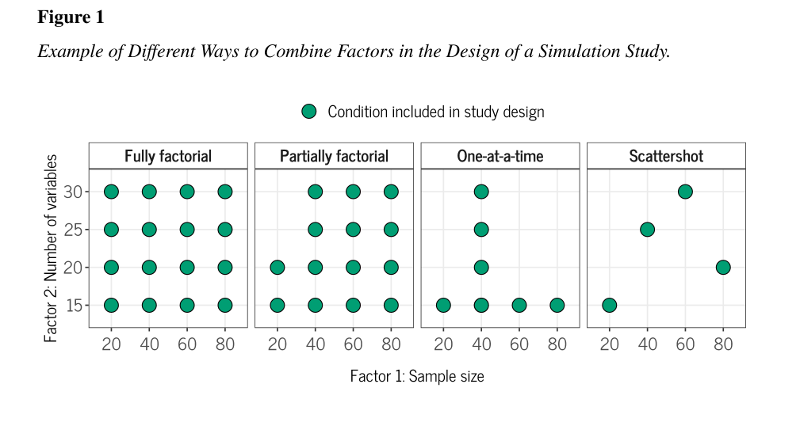

```{r, include=FALSE}

knitr::opts_chunk$set(message = FALSE,
                      warning = FALSE)

```

If you have a large number of iterations and lots of parameters, simulations can take a surprisingly long time to run and their results can be difficult to interpret. 

[Siepe et al. (2023)](https://osf.io/preprints/psyarxiv/ufgy6/) "Simulation Studies for Methodological Research in Psychology: A Standardized Template for Planning, Preregistration, and Reporting" provide very useful discussions about this and several other considerations when designing a simulation study. They discuss how researchers may choose to simulate either all permutations of parameters, only a subset of them, and that these subsets can be chosen in different ways. From their article: 

```{r}



```

This lesson will construct a one-at-a-time simulation. This involves choosing a set of "default" values for each parameter and varying just one parameter between simulations. The results can then be summarized more easily and intuitively across these values of a single parameter. However, you have to give careful thought to your choice of default values, as interaction effects between parameters can mean that you get very different results for other defaults. Because of this sensitivity, we carefully label the assumptions (i.e., the default values) for each simulation in each plot. 

```{r}

# dependencies ----
# repeated here for the sake of completeness 

library(tidyr)
library(dplyr)
library(forcats)
library(readr)
library(purrr) 
library(ggplot2)
library(effsize)


# set the seed ----
# for the pseudo random number generator to make results reproducible
set.seed(42)


# define data generating function ----
generate_data <- function(n,
                          mean_control,
                          mean_intervention,
                          sd_control,
                          sd_intervention) {
  
  data <- 
    bind_rows(
      tibble(condition = "control",
             score = rnorm(n = n, mean = mean_control, sd = sd_control)),
      tibble(condition = "intervention",
             score = rnorm(n = n, mean = mean_intervention, sd = sd_intervention))
    ) 
  
  return(data)
}

# define data analysis function ----
analyse_data <- function(data) {
  res_t_test <- t.test(formula = score ~ condition, 
                       data = data,
                       var.equal = FALSE,
                       alternative = "two.sided")
  
  res <- tibble(p = res_t_test$p.value)

  return(res)
}


# define experiment parameters ----

# # hypothetical default grid that the others will vary from on just on parameter at a time
# experiment_parameters_grid_default <- expand_grid(
#   n = 50,
#   mean_control = 0,
#   mean_intervention = 0.5, 
#   sd_control = 1,
#   sd_intervention = 1,
#   iteration = 1:1000
# )

experiment_parameters_grid_n <- expand_grid(
  n = c(5, 10, 15, 20, seq(from = 25, to = 300, by = 25)),
  mean_control = 0,
  mean_intervention = 0.5,
  sd_control = 1,
  sd_intervention = 1,
  iteration = 1:1000
)

experiment_parameters_grid_mean <- expand_grid(
  n = 50,
  mean_control = 0,
  mean_intervention = seq(from = .1, to = 1, by = 0.1),
  sd_control = 1,
  sd_intervention = 1,
  iteration = 1:1000
)

experiment_parameters_grid_sd <- expand_grid(
  n = 50,
  mean_control = 0,
  mean_intervention = 0.5,
  sd_control = 1,
  sd_intervention = seq(from = .5, to = 1.5, by = 0.1),
  iteration = 1:1000
)

# run simulation ----
simulation_n <- 
  experiment_parameters_grid_n |>
  mutate(generated_data = pmap(list(n,
                                    mean_control,
                                    mean_intervention,
                                    sd_control,
                                    sd_intervention),
                               generate_data)) |>
  mutate(analysis_results = pmap(list(generated_data),
                                 analyse_data))

simulation_mean <- 
  experiment_parameters_grid_mean |>
  mutate(generated_data = pmap(list(n,
                                    mean_control,
                                    mean_intervention,
                                    sd_control,
                                    sd_intervention),
                               generate_data)) |>
  mutate(analysis_results = pmap(list(generated_data),
                                 analyse_data))

simulation_sd <- 
  experiment_parameters_grid_sd |>
  mutate(generated_data = pmap(list(n,
                                    mean_control,
                                    mean_intervention,
                                    sd_control,
                                    sd_intervention),
                               generate_data)) |>
  mutate(analysis_results = pmap(list(generated_data),
                                 analyse_data))


# summarize results across conditions ----
simulation_summary_n <- simulation_n |>
  unnest(analysis_results) |>
  group_by(n, mean_intervention, sd_intervention) |>
  summarize(power = janitor::round_half_up(mean(p < .05), 2))

simulation_summary_mean <- simulation_mean |>
  unnest(analysis_results) |>
  group_by(n, mean_intervention, sd_intervention) |>
  summarize(power = janitor::round_half_up(mean(p < .05), 2))

simulation_summary_sd <- simulation_sd |>
  unnest(analysis_results) |>
  group_by(n, mean_intervention, sd_intervention) |>
  summarize(power = janitor::round_half_up(mean(p < .05), 2))

# # tables
# simulation_summary_n
# simulation_summary_mean
# simulation_summary_sd

# plots
ggplot(simulation_summary_n, aes(n, power)) + 
  geom_hline(yintercept = 0.8, linetype = "dotted") +
  geom_line() +
  geom_point() +
  scale_y_continuous(limits = c(0, 1), breaks = c(0, .2, .4, .6, .8, 1)) +
  theme_linedraw() +
  xlab("N per condition") +
  ylab("Power") +
  ggtitle("Power as a function of sample size\nAssuming Cohen's d = 0.5 and equal variances") 

ggplot(simulation_summary_mean, aes(mean_intervention, power)) + 
  geom_line() +
  geom_hline(yintercept = 0.8, linetype = "dotted") +
  geom_point() +
  scale_y_continuous(limits = c(0, 1), breaks = c(0, .2, .4, .6, .8, 1)) +
  theme_linedraw() +
  xlab("Population difference in means between conditions") +
  ylab("Power") +
  ggtitle("Power as a function of population differences in means between conditions\nAssuming n = 50 per condition and equal variances")

ggplot(simulation_summary_sd, aes(sd_intervention, power)) + 
  geom_line() +
  geom_hline(yintercept = 0.8, linetype = "dotted") +
  geom_point() +
  scale_y_continuous(limits = c(0, 1), breaks = c(0, .2, .4, .6, .8, 1)) +
  theme_linedraw() +
  xlab("Population difference in SDs between conditions") +
  ylab("Power") +
  ggtitle("Power as a function of population differences in SDs between conditions\nAssuming n = 50 per condition and Cohen's d = 0.5")

```

# Check your understanding

- What are the advantages of using full factorial designs over one-at-a-time simulation designs? 
- What are the advantages of using one-at-a-time simulation designs over full factorial designs?

# Assignment

This lesson demonstrated how you can construct one-at-a-time simulations using multiple expand_grid() calls and separate simulations. How could you also accomplish the same results using a single expand_grid and a single simulation being run? Why would you probably not do it this way?

Siepe et al. (2023) also discuss other designs like partially factorial designs. How would you create a partially factorial design set of parameters to be simulated? E.g., if you wanted to simulate Ns from 25 to 300 in steps of 25, effect sizes (mean_intervention) from .1 to 1 in steps of 0.1, and equality of variances (sd_intervention) from .5 to 1.5 in steps of 0.1, **BUT** for some reason you for all sample sizes of N >= 200 you only wanted to simulate under the assumption of equal variances (i.e., sd_intervention == 1), how would you construct a grid of parameters that meets this? Exactly how many rows would this parameter grid have, assuming there is only 1 iteration? 

# Session info

```{r}

sessionInfo()

```


