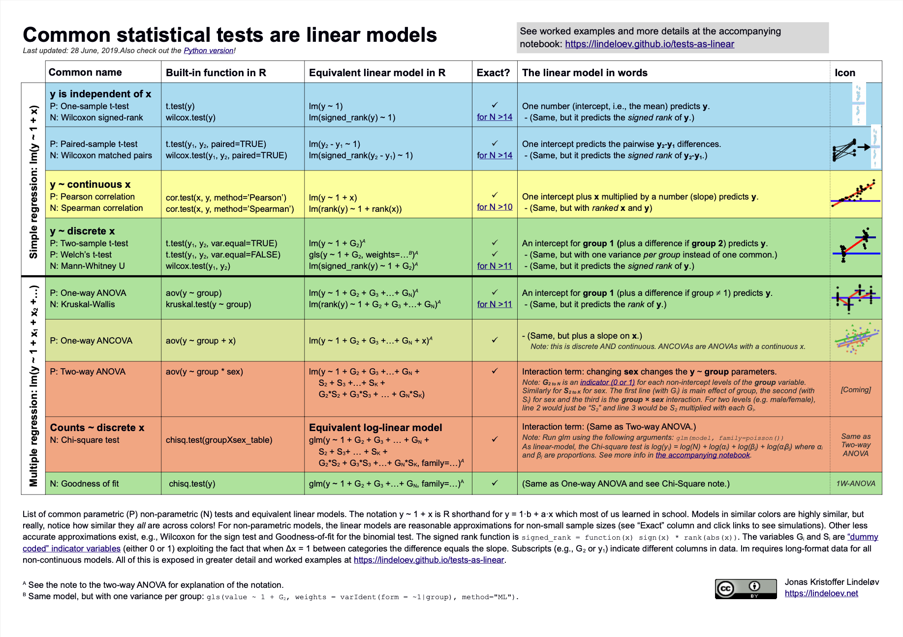

# Check your understanding

What is the relationship between a linear regression, a Student's t-test and a Wilcox rank-sum test? Or between linear regression and ANOVA?

What is the difference between a hypothesis test like a Student's t-test and a test of assumptions such as Shapiro-Wilk's test (for normality) or Levene's test (for homogeneity of variances)?


# Answer

[Almost everything is a linear model](https://lindeloev.github.io/tests-as-linear).

```{r}



```

# Overview

What do most statistics textbooks tell you to do when trying to test if two groups' means differ?

1. Check assumptions of an independent Student's t-test are met, e.g., normality of data and homogeneity of variances.
2. If so, run an interpret an independent Student's t-test.
3. If not, then perhaps perhaps either 'interpret results with caution' (which always feels vague) or run and interpret a non-parametric test instead.

Why? What benefits are there for doing so? Or what bad things happen if you don't?

In a previous session, we observed that violations of the assumption of normality actually has very little impact on the false-positive and false-negative rates of a t-test, as long as the two conditions have similarly non-normal data, which is plausible in many situations. This lesson seeks to answer two related questions:

1. Just like hypothesis tests, assumptions tests are just inferential tests of other properties (e.g., differences in SDs rather than differences in means), and as such they have false-positive rates and false-negative rates (statistical power). What is the power of these tests under different degrees of violations of assumptions? I.e. what proportion of the time do they get it wrong?
2. What is the aggregate benefit of choosing a hypothesis test based on the results of assumption tests? This multi-step researcher behavior can itself be simulated. 


# Citation & License

Citation: 

Ian Hussey (2024) Improving your statistical inferences through simulation studies in R. https://github.com/ianhussey/simulation-course

License: 

[CC BY 4.0](https://creativecommons.org/licenses/by/4.0/deed.en)

```{r, include=FALSE}

# set default chunk options
knitr::opts_chunk$set(message = FALSE,
                      warning = FALSE)

# disable scientific notation
options(scipen = 999) 

```

```{r}

# dependencies
library(tidyr)
library(dplyr)
library(forcats)
library(readr)
library(purrr) 
library(ggplot2)
library(scales)
library(sn)
library(knitr)
library(kableExtra)

```

# Power of Student's t-test 

Code taken from the previous lesson, with some simplifications.

```{r fig.height=5, fig.width=10}

# remove all objects from environment ----
rm(list = ls())

# define data generating function ----
generate_data <- function(n,
                          location_control, # location, akin to mean
                          location_intervention,
                          scale, # scale, akin to SD
                          skew) { # slant/skew. When 0, produces normal/gaussian data
  
  
  data_control <- 
    tibble(condition = "control",
           score = rsn(n = n, 
                       xi = location_control, # location, akin to mean
                       omega = scale, # scale, akin to SD
                       alpha = skew)) # slant/skew. When 0, produces normal/gaussian data
  
  data_intervention <- 
    tibble(condition = "intervention",
           score = rsn(n = n, 
                       xi = location_intervention, # location, akin to mean
                       omega = scale, # scale, akin to SD
                       alpha = skew)) # slant/skew. When 0, produces normal/gaussian data
  
  data <- bind_rows(data_control,
                    data_intervention) 
  
  return(data)
}


# define data analysis function ----
analyze_data_students_t <- function(data) {
  
  hypothesis_test_students_t <- t.test(formula = score ~ condition, 
                                       data = data,
                                       var.equal = TRUE,
                                       alternative = "two.sided")
  
  res <- tibble(hypothesis_test_p_students_t = hypothesis_test_students_t$p.value) 
  
  return(res)
}


# set the seed ----
# for the pseudo random number generator to make results reproducible
set.seed(42)


# define experiment parameters ----
experiment_parameters <- expand_grid(
  n = c(10, 25, 50, 100, 200),
  mu_control = 0,
  mu_intervention = 0.5, 
  sigma = 1,
  skew = c(0, 2, 4, 8, 12),     # slant/skew. When 0, produces normal/gaussian data
  iteration = 1:1000 
) |>
  # calculate skew-normal parameters
  # don't worry about the math, it's not important to understand
  mutate(delta = skew / sqrt(1 + skew^2),
         scale = sigma / sqrt(1 - 2 * delta^2 / pi),
         location_control = mu_control - scale * delta * sqrt(2 / pi),
         location_intervention = mu_intervention - scale * delta * sqrt(2 / pi)) 


# run simulation ----
simulation <- 
  # using the experiment parameters
  experiment_parameters |>
  
  # generate data using the data generating function and the parameters relevant to data generation
  mutate(generated_data = pmap(list(n,
                                    location_control,
                                    location_intervention,
                                    scale,
                                    skew),
                               generate_data)) |>
  
  # apply the analysis function to the generated data using the parameters relevant to analysis
  mutate(analysis_results_students_t = pmap(list(generated_data),
                                            analyze_data_students_t))

# summarise simulation results over the iterations ----
## ie what proportion of p values are significant (< .05)
simulation_summary <- simulation |>
  unnest(analysis_results_students_t) |>
  mutate(skew = as.factor(skew)) |>
  group_by(n, 
           location_control,
           location_intervention,
           scale, 
           skew) |>
  summarize(proportion_significant_students_t = mean(hypothesis_test_p_students_t < .05),
            .groups = "drop")

# plot
ggplot(simulation_summary, aes(n*2, proportion_significant_students_t, color = skew)) +
  geom_hline(yintercept = 0.80, linetype = "dotted") +
  geom_hline(yintercept = 0.05, linetype = "dotted") +
  geom_point() +
  geom_line() +
  scale_x_continuous(breaks = breaks_pretty(n = 9), name = "Total sample size") +
  scale_y_continuous(limits = c(0, 1), breaks = breaks_pretty(n = 9), name = "Proportion significant results") +
  theme_linedraw() +
  scale_color_viridis_d(begin = 0.2, end = 0.8)

```

# Power of Student's t-test vs. Wilcoxon rank-sum test 

Aka Mann-Whitney U-test.

## Exercise

Write a function called `analyze_data_wilcox()` that uses `wilcox.test()` instead of `t.test()` to compare the differences in central tendency between the conditions.  

```{r}


```


## Answer

```{r}

# define data analysis function ----
analyze_data_wilcox <- function(data) {
  
  hypothesis_test_wilcox <- wilcox.test(formula = score ~ condition,  # added
                                        data = data,
                                        alternative = "two.sided")
  
  res <- tibble(hypothesis_test_p_wilcox = hypothesis_test_wilcox$p.value)  # added 
  
  return(res)
}

```

## Simulation

```{r fig.height=5, fig.width=10}

# run simulation ----
simulation_alt_analysis <- 
  # using the experiment parameters
  simulation |>

  # apply the analysis function to the generated data using the parameters relevant to analysis
  mutate(analysis_results_wilcox = pmap(list(generated_data),
                                        analyze_data_wilcox))


# summarise simulation results over the iterations ----
## ie what proportion of p values are significant (< .05)
simulation_summary <- simulation_alt_analysis |>
  unnest(analysis_results_students_t) |>
  unnest(analysis_results_wilcox) |>
  mutate(skew = as.factor(skew)) |>
  group_by(n, 
           location_control,
           location_intervention,
           scale, 
           skew) |>
  summarize(proportion_significant_students_t = mean(hypothesis_test_p_students_t < .05),
            proportion_significant_wilcox = mean(hypothesis_test_p_wilcox < .05),
            .groups = "drop")

# plots
ggplot(simulation_summary, aes(n*2, proportion_significant_students_t, color = skew)) +
  geom_hline(yintercept = 0.80, linetype = "dotted") +
  geom_hline(yintercept = 0.05, linetype = "dotted") +
  geom_point() +
  geom_line() +
  scale_x_continuous(breaks = breaks_pretty(n = 9), name = "Total sample size") +
  scale_y_continuous(limits = c(0, 1), breaks = breaks_pretty(n = 9), name = "Proportion significant results") +
  theme_linedraw() +
  scale_color_viridis_d(begin = 0.2, end = 0.8) +
  ggtitle("Power of Student's t-test for Cohen's d = 0.5")

ggplot(simulation_summary, aes(n*2, proportion_significant_wilcox, color = skew)) +
  geom_hline(yintercept = 0.80, linetype = "dotted") +
  geom_hline(yintercept = 0.05, linetype = "dotted") +
  geom_point() +
  geom_line() +
  scale_x_continuous(breaks = breaks_pretty(n = 9), name = "Total sample size") +
  scale_y_continuous(limits = c(0, 1), breaks = breaks_pretty(n = 9), name = "Proportion significant results") +
  theme_linedraw() +
  scale_color_viridis_d(begin = 0.2, end = 0.8) +
  ggtitle("Power of Wilcoxon rank-sum test for Cohen's d = 0.5")

```

- What's the upside and downside of each?

# Power of Shapiro-Wilk's test with skew-normal data

## Exercise

Write a function called `test_assumption_of_normality()` that uses `shapiro.test()` to assess for non-normality in each condition (control and intervention). It should return a p value for both tests.

```{r}


```


## Answer

```{r}

# define data analysis function ----
test_assumption_of_normality <- function(data) {
  
  fit_intervention <- data |>
    filter(condition == "intervention") |>
    pull(score) |>
    shapiro.test()
  
  fit_control <- data |>
    filter(condition == "control") |>
    pull(score) |>
    shapiro.test()
  
  res <- tibble(assumption_test_p_sharpirowilks_intervention = fit_intervention$p.value, 
                assumption_test_p_sharpirowilks_control = fit_control$p.value) 
  
  return(res)
}

```

## Simulation

Test for normality in each of two samples, and return a decision of non-normality if it is found in either.

```{r fig.height=5, fig.width=10}

# run simulation ----
simulation_normality <- 
  # using the experiment parameters
  simulation_alt_analysis |>

  # apply the analysis function to the generated data using the parameters relevant to analysis
  mutate(analysis_results_normality = pmap(list(generated_data),
                                           test_assumption_of_normality))


# summarise simulation results over the iterations ----
## ie what proportion of p values are significant (< .05)
simulation_summary <- simulation_normality |>
  unnest(analysis_results_students_t) |>
  unnest(analysis_results_wilcox) |>
  unnest(analysis_results_normality) |>
  mutate(skew = as.factor(skew)) |>
  # choose the lower of the two shapiro wilk's tests' p values
  mutate(assumption_test_p_sharpirowilks_lower = ifelse(assumption_test_p_sharpirowilks_intervention < assumption_test_p_sharpirowilks_control, 
                                                        assumption_test_p_sharpirowilks_intervention, 
                                                        assumption_test_p_sharpirowilks_control)) |>
  group_by(n, 
           location_control,
           location_intervention,
           scale, 
           skew) |>
  summarize(proportion_significant_students_t = mean(hypothesis_test_p_students_t < .05),
            proportion_significant_wilcox = mean(hypothesis_test_p_wilcox < .05),
            proportion_significant_shapirowilks = mean(assumption_test_p_sharpirowilks_lower < .05),
            .groups = "drop")

# plot
ggplot(simulation_summary, aes(n*2, proportion_significant_shapirowilks, color = skew)) +
  geom_hline(yintercept = 0.80, linetype = "dotted") +
  geom_hline(yintercept = 0.05, linetype = "dotted") +
  geom_point() +
  geom_line() +
  scale_x_continuous(breaks = breaks_pretty(n = 9), name = "Total sample size") +
  scale_y_continuous(limits = c(0, 1), breaks = breaks_pretty(n = 9), name = "Proportion significant results") +
  theme_linedraw() +
  scale_color_viridis_d(begin = 0.2, end = 0.8) +
  ggtitle("Power of Shapiro-Wilks test applied to each condition")

```

- What does this tell us?


# Conditionally running a Student's t-test or a Wilcoxon rank-sum test depending on Shapiro-Wilk's test for normality in both samples

## Exercise

Modify the code below to implement condition logic between how the tests are interpreted. 

I.e., for each iteration, calculate a conditional p value: if either of the Shapiro-Wilks tests are significant (evidence of non-normality), use the p value from the Wilcox test; if not, use the Student's t test's p value. 

Summarize the power of the conditional p value vs. the Wilcox's test's p value. This compares the workflows where we a) use Shapiro-Wilk's tests to choose which method to use to test the hypothesis vs. b) just use the non-parametric test by default.

```{r}

# summarise simulation results over the iterations ----
simulation_summary <- simulation_normality |>
  unnest(analysis_results_students_t) |>
  unnest(analysis_results_wilcox) |>
  unnest(analysis_results_normality) |>
  # choose the lower of the two shapiro wilk's tests' p values
  mutate(assumption_test_p_sharpirowilks_lower = ifelse(assumption_test_p_sharpirowilks_intervention < assumption_test_p_sharpirowilks_control, 
                                                        assumption_test_p_sharpirowilks_intervention, 
                                                        assumption_test_p_sharpirowilks_control)) |>
  # condition logic
  mutate(hypothesis_p_conditional = ifelse(assumption_test_p_sharpirowilks_lower < .05, 
                                           hypothesis_test_p_wilcox,
                                           hypothesis_test_p_students_t)) |>
  # summarize
  mutate(skew = as.factor(skew)) |>
  group_by(n, 
           location_control,
           location_intervention,
           scale, 
           skew) |>
  summarize(proportion_significant_conditional = mean(hypothesis_p_conditional < .05),
            proportion_significant_wilcox = mean(hypothesis_test_p_wilcox < .05),
            .groups = "drop") |>
  mutate(power_diff = proportion_significant_conditional - proportion_significant_wilcox)

```


## Answer

This stimulation tests normality in both conditions' data, as well as testing for differences in the central tendency using both parametric and non-parametric tests. Which test of the differences in central tendency is used for each simulated data set is determined by whether the assumption of normality is detectably violated.

```{r fig.height=5, fig.width=10}

# summarise simulation results over the iterations ----
simulation_summary <- simulation_normality |>
  unnest(analysis_results_students_t) |>
  unnest(analysis_results_wilcox) |>
  unnest(analysis_results_normality) |>
  # choose the lower of the two shapiro wilk's tests' p values
  mutate(assumption_test_p_sharpirowilks_lower = ifelse(assumption_test_p_sharpirowilks_intervention < assumption_test_p_sharpirowilks_control, 
                                                        assumption_test_p_sharpirowilks_intervention, 
                                                        assumption_test_p_sharpirowilks_control)) |>
  # condition logic
  mutate(hypothesis_p_conditional = ifelse(assumption_test_p_sharpirowilks_lower < .05, 
                                           hypothesis_test_p_wilcox,
                                           hypothesis_test_p_students_t)) |>
  # summarize
  mutate(skew = as.factor(skew)) |>
  group_by(n, 
           location_control,
           location_intervention,
           scale, 
           skew) |>
  summarize(proportion_significant_conditional = mean(hypothesis_p_conditional < .05),
            proportion_significant_wilcox = mean(hypothesis_test_p_wilcox < .05),
            .groups = "drop") |>
  mutate(power_diff = proportion_significant_conditional - proportion_significant_wilcox)

# plots
ggplot(simulation_summary, aes(n*2, proportion_significant_conditional, color = skew)) +
  geom_hline(yintercept = 0.80, linetype = "dotted") +
  geom_hline(yintercept = 0.05, linetype = "dotted") +
  geom_point() +
  geom_line() +
  scale_x_continuous(breaks = breaks_pretty(n = 9), name = "Total sample size") +
  scale_y_continuous(limits = c(0, 1), breaks = breaks_pretty(n = 9), name = "Proportion significant results") +
  theme_linedraw() +
  scale_color_viridis_d(begin = 0.2, end = 0.8) +
  ggtitle("Power of conditional Student's t-test vs. Wilcox test for Cohen's d = 0.5")

ggplot(simulation_summary, aes(n*2, proportion_significant_wilcox, color = skew)) +
  geom_hline(yintercept = 0.80, linetype = "dotted") +
  geom_hline(yintercept = 0.05, linetype = "dotted") +
  geom_point() +
  geom_line() +
  scale_x_continuous(breaks = breaks_pretty(n = 9), name = "Total sample size") +
  scale_y_continuous(limits = c(0, 1), breaks = breaks_pretty(n = 9), name = "Proportion significant results") +
  theme_linedraw() +
  scale_color_viridis_d(begin = 0.2, end = 0.8) +
  ggtitle("Power of Wilcoxon rank-sum test for Cohen's d = 0.5")

ggplot(simulation_summary, aes(power_diff)) +
  geom_histogram(binwidth = 0.01) +
  theme_linedraw() +
  xlab("Difference in power between conditional tests\nvs. always running non-parametric")

```

- What does this tell us about whether we should (a) test the assumption of normality and then run a (non)parameteric test conditionally or just run the non-parametric test by default?

- What interpretation issues might be an argument against doing this by default?

- Are you starting to see why statisticians usually reply with "it depends" when we ask them questions?


# Recap

What did you learn here?

- About statistical tests?
- About using Monte Carlo simulations to understand not just single tests but to understand workflows?
- About how to use this {purrr} simulation workflow to analyze data more than one way and make conditional decisions, in order to model the behavior of scientists?

# At-home exercises

## Collate the simulation above into a single code chunk with all the pieces to run the full simulation

```{r}

# remove all objects from environment to ensure you're starting from a blank page
rm(list = ls())

# paste necessary code in here

```

## Elaborate the simulation

One relatively simpler extension would be to assess how much better or worse just using the Student's t test by default is compared to a) using Student's t-test vs. Wilcox conditionally based on the Shapiro Wilks tests or b) using the Wilcox test by default. I.e., try adding c) using Student's t-test by default.

Right now the simulation only examines a fixed effect size. Perhaps the supposed negative impact of violating normality would be seen at other effect sizes? Vary this or indeed other things to make an informed decision about how to choose which test(s) to run to make the inference about differences in means between conditions. 

```{r}


```

## Develop a simulation to examine the power of the conditional use of (non)parametric based on heteroscedasticity vs using non-parametric tests by default

Decisions about which hypothesis test is used are also made on the basis of other tests of those assumptions. For example, heteroscedasticity (equal SDs) can be tested using `leveneTest()`. This has lower power than Bartlett's test but does not assume normality. 

Write a simulation that is analogous to the one above, but which compares the statistical power of a) the conditional use of Student's t test or Wilcox test based on the result of Levene's test vs. b) using Wilcox test by default. 

For simplicity:

- Use a true effect population effect size of Cohen's d = 0.5 in all simulations. 
- Use only normal data.
- Vary degree of heteroscedasticity between the groups, i.e., set it to 1, 1.5, or 2 in the intervention group. Work out what you'll need to set it to in the control group and why.
- Use the same sample sizes as as in the above simulation (i.e., `n = c(10, 25, 50, 100, 200)`).

```{r}


```

# Session info

```{r}

sessionInfo()

```


