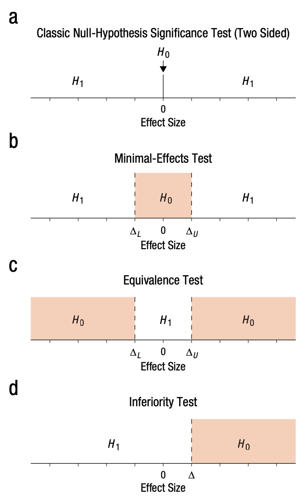

# Overview of tutorial

This tutorial simulates a population effect size of Cohen's d = 0.5 for different sample sizes, and examines the relationship between Cohen's d, its 95% Confidence Interval, and the significance of the t-test's *p*-value. 

By the end of this lesson you should understand that *p*-values are re-expressions of the same information conveyed by Confidence Intervals, and that statistical power is a re-expression of the width of Confidence Intervals.

# Citation & License

Citation: 

Ian Hussey (2024) Improving your statistical inferences through simulation studies in R. https://github.com/ianhussey/simulation-course

License: 

[CC BY 4.0](https://creativecommons.org/licenses/by/4.0/deed.en)

```{r, include=FALSE}

# set default chunk options
knitr::opts_chunk$set(message = FALSE,
                      warning = FALSE)

# disable scientific notation
options(scipen = 999) 

```

# Dependencies

```{r}

library(tidyr)
library(dplyr)
library(purrr) 
library(stringr)
library(forcats)
library(ggplot2)
library(scales)
library(patchwork)
library(knitr)
library(kableExtra)
library(janitor)
library(effsize)

```

# Simulation

```{r}

# functions for simulation
generate_data <- function(n_per_condition,
                          mean_control,
                          mean_intervention,
                          sd) {
  
  data_control <- 
    tibble(condition = "control",
           score = rnorm(n = n_per_condition, mean = mean_control, sd = sd))
  
  data_intervention <- 
    tibble(condition = "intervention",
           score = rnorm(n = n_per_condition, mean = mean_intervention, sd = sd))
  
  data_combined <- bind_rows(data_control,
                             data_intervention) |>
    mutate(condition = fct_relevel(condition, "intervention", "control"))
  
  return(data_combined)
}

analyze <- function(data) {

  res_t_test <- t.test(formula = score ~ condition, 
                       data = data,
                       var.equal = TRUE,
                       alternative = "two.sided")
  
  res_cohens_d <- effsize::cohen.d(formula = score ~ condition,
                                   data = data,
                                   pooled = TRUE)
  
  res <- tibble(p = res_t_test$p.value, 
                cohens_d = res_cohens_d$estimate,
                cohens_d_ci_lower = res_cohens_d$conf.int[1],
                cohens_d_ci_upper = res_cohens_d$conf.int[2])

  return(res)
}


# set seed
set.seed(42)

# simulation parameters
experiment_parameters <- expand_grid(
  n_per_condition = seq(from = 10, to = 90, by = 10),
  mean_control = 0,
  mean_intervention = 0.5,
  sd = 1,
  iteration = 1:1000
) 

# run simulation
simulation <- experiment_parameters |>
  mutate(generated_data = pmap(list(n_per_condition, 
                                    mean_control,
                                    mean_intervention,
                                    sd),
                               generate_data)) |>
  mutate(results = pmap(list(generated_data),
                        analyze))

```

# Cohen's d by sample size

```{r fig.height=5, fig.width=6}

# wrangle
simulation |>
  unnest(results) |>
  # plot
  ggplot(aes(n_per_condition*2, cohens_d)) +
  geom_jitter(alpha = 0.25) +
  geom_hline(yintercept = 0, linetype = "dotted") +
  scale_x_continuous(breaks = breaks_pretty(n = 10),
                     name = "Total N") +
  scale_y_continuous(breaks = breaks_pretty(n = 10),
                     #limits = c(0,1),
                     name = "Cohen's d") +
  theme_linedraw() +
  scale_color_viridis_d(begin = 0.3, end = 0.7) +
  ggtitle("Population Cohen's d = 0.5")

```

- Each point is a Cohen's d from one dataset (i.e., one iteration).
- The population Cohen's d is 0.5. Notice how the distribution of sample Cohen's d values vary by sample size: Cohen's d values above 2.0 and below -0.5 are observed when sample size is very small. As sample size gets larger, they stabilize. However, individual datasets still generate Cohen's d values that diverge substantially from the true value of 0.5.

## Ordered by statistical significance

Let's color the Cohen's ds by their statistical significance. 

```{r fig.height=5, fig.width=6}

# wrangle
simulation |>
  unnest(results) |>
  mutate(significant = p < .05) |>
  # plot
  ggplot(aes(n_per_condition*2, cohens_d, color = significant)) +
  geom_jitter(alpha = 0.25) +
  geom_hline(yintercept = 0, linetype = "dotted") +
  scale_x_continuous(breaks = breaks_pretty(n = 10),
                     name = "Total N") +
  scale_y_continuous(breaks = breaks_pretty(n = 10),
                     #limits = c(0,1),
                     name = "Cohen's d") +
  theme_linedraw() +
  scale_color_viridis_d(begin = 0.3, end = 0.7, direction = -1) +
  ggtitle("Population Cohen's d = 0.5")

```

- There is clearly a cut-off value for each sample size that determines when a Cohen's d value is associated with a significant vs. non-significant t-test p-value. What determines this cut-off? Do you have an intuition for it?

## Average effect size for significant effects

Quick aside: Significant results are more likely to be published than non significant ones. If we only look at the significant results, what is the average effect size by N?

Plot only the significant effect sizes, and add their means.

```{r fig.height=5, fig.width=6}

# wrangle
simulation |>
  unnest(results) |>
  mutate(significant = p < .05) |>
  filter(significant) |>
  # plot
  ggplot(aes(n_per_condition*2, cohens_d, color = significant)) +
  geom_jitter(alpha = 0.25) +
  # add mean points 
  stat_summary(fun = "mean",
               geom = "point",
               size = 3,
               color = "#35608DFF") +
  geom_hline(yintercept = 0, linetype = "dotted") +
  scale_x_continuous(breaks = breaks_pretty(n = 10),
                     name = "Total N") +
  scale_y_continuous(breaks = breaks_pretty(n = 10),
                     #limits = c(0,1),
                     name = "Cohen's d") +
  theme_linedraw() +
  scale_color_viridis_d(begin = 0.3, end = 0.7, direction = -1) +
  ggtitle("Population Cohen's d = 0.5")

```

- Back to the q: There is clearly a cut-off value for each sample size that determines when a Cohen's d value is associated with a significant vs. non-significant t-test p-value. What determines this cut-off? Do you have an intuition for it?

# Cohen's d and its 95% CIs 

To understand it further, let's add the 95% Confidence Intervals.

## Randomly select one dataset per sample size

To understand the plot, we'll plot just one data set (iteration) for each sample size.

Re-run the chunk to select new random values. Notice how the magnitude of the Cohen's d values 'dance' around between data sets due to random sampling error, but the width of the Confidence Intervals do not. Confidence width is steady as it is a function of sample size.

```{r}

# wrangle
simulation |>
  unnest(results) |>
  mutate(significant = p < .05) |>
  # randomly sample 1 effects size per sample size
  group_by(n_per_condition) |>
  slice_sample(n = 1) |>
  ungroup() |>
  # plot
  ggplot(aes(n_per_condition*2, cohens_d, color = significant)) +
  geom_point() +
  # 95% CIs
  geom_linerange(aes(ymin = cohens_d_ci_lower, ymax = cohens_d_ci_upper)) +
  geom_hline(yintercept = 0, linetype = "dotted") +
  scale_x_continuous(breaks = breaks_pretty(n = 10),
                     name = "Total N") +
  scale_y_continuous(breaks = breaks_pretty(n = 10),
                     #limits = c(0,1),
                     name = "Cohen's d") +
  theme_linedraw() +
  scale_color_viridis_d(begin = 0.3, end = 0.7) +
  ggtitle("Population Cohen's d = 0.5\nOne randomly selected dataset per sample size")

```

- Significant when 95% CI excludes zero effect size

## All datasets

Now let's plot all the data sets (iterations).

```{r fig.height=10, fig.width=12}

# wrangle
simulation |>
  unnest(results) |>
  mutate(significant = p < .05,
         total_n = paste("N =", n_per_condition*2),
         total_n = fct_reorder(total_n, as.numeric(str_extract(total_n, "\\d+")))) |>
  # plot
  ggplot(aes(iteration, cohens_d, color = significant)) +
  geom_point(alpha = 0.5) +
  geom_linerange(aes(ymin = cohens_d_ci_lower, ymax = cohens_d_ci_upper), alpha = 0.2) +
  geom_hline(yintercept = 0, linetype = "dotted") +
  scale_x_continuous(breaks = breaks_pretty(n = 10),
                     name = "Iteration") +
  scale_y_continuous(breaks = breaks_pretty(n = 10),
                     #limits = c(0,1),
                     name = "Cohen's d") +
  theme_linedraw() +
  scale_color_viridis_d(begin = 0.3, end = 0.7) +
  facet_wrap(~ total_n, ncol = 3, scales = "free_y")

```

## Ordered by Cohen's d

The above plot is hard to understand. Let's order the Cohen's ds from smallest to largest, so the small ones are on the left and the large ones are on the right.

```{r fig.height=10, fig.width=12}

# wrangle
simulation |>
  unnest(results) |>
  mutate(significant = p < .05,
         total_n = paste("N =", n_per_condition*2),
         total_n = fct_reorder(total_n, as.numeric(str_extract(total_n, "\\d+")))) |>
  arrange(n_per_condition, cohens_d) |>
  group_by(n_per_condition) |>
  mutate(rank = row_number()) |>
  ungroup() |>
  # plot
  ggplot(aes(rank, cohens_d, color = significant)) +
  geom_point() +
  geom_linerange(aes(ymin = cohens_d_ci_lower, ymax = cohens_d_ci_upper), alpha = 0.2) +
  geom_hline(yintercept = 0, linetype = "dotted") +
  scale_x_continuous(breaks = breaks_pretty(n = 10),
                     name = "Ranked iteration") +
  scale_y_continuous(breaks = breaks_pretty(n = 10),
                     #limits = c(0,1),
                     name = "Cohen's d") +
  theme_linedraw() +
  scale_color_viridis_d(begin = 0.3, end = 0.7) +
  facet_wrap(~ total_n, ncol = 3)

```

- Notice the relationship between 95% CI and p value significance.
- A certain percentage of Cohen's ds are green vs. blue. What is this percentage also called? What statistical property?

# Mean Cohen's d and mean interval width by sample size

Now let's average over the Cohen's ds in each condition to find the mean Cohen's d and its mean 95% CIs.

```{r fig.height=2.5, fig.width=6}

# wrangle
simulation_summary <- simulation |>
  # unnest results
  unnest(results) |>
  group_by(n_per_condition) |>
  summarize(proportion_significant = mean(p < .05), 
            mean_cohens_d = mean(cohens_d),
            mean_cohens_d_ci_lower = mean(cohens_d_ci_lower),
            mean_cohens_d_ci_upper = mean(cohens_d_ci_upper)) |>
  mutate(centered_mean_cohens_d_ci_lower = mean_cohens_d_ci_lower - mean_cohens_d,
         centered_mean_cohens_d_ci_upper = mean_cohens_d_ci_upper - mean_cohens_d)

# plot results
p1 <- ggplot(simulation_summary, aes(n_per_condition*2, mean_cohens_d)) +
  geom_point() +
  geom_linerange(aes(ymin = mean_cohens_d_ci_lower, ymax = mean_cohens_d_ci_upper)) +
  geom_hline(yintercept = 0, linetype = "dotted") +
  scale_x_continuous(breaks = breaks_pretty(n = 10),
                     name = "Total sample size") +
  scale_y_continuous(breaks = breaks_pretty(n = 5),
                     #limits = c(0,1),
                     name = "Mean Cohen's d\n(and mean 95% CIs)") +
  theme_linedraw() +
  ggtitle("Population Cohen's d = 0.5")

p1

```

# Mean Cohen's d and power by sample size

```{r fig.height=5, fig.width=6}

p2 <- ggplot(simulation_summary, aes(n_per_condition*2, proportion_significant)) +
  geom_point() +
  geom_hline(yintercept = 0.05, linetype = "dotted") +
  geom_hline(yintercept = 0.80, linetype = "dotted") +
  scale_x_continuous(breaks = breaks_pretty(n = 10),
                     name = "Total sample size") +
  scale_y_continuous(breaks = breaks_pretty(n = 5),
                     limits = c(0,1),
                     name = "Proportion of significant\np-values") +
  theme_linedraw() 

p1 + p2 + plot_layout(ncol = 1)

```

# Exercise: Power for equivalence test

See Lakens et al., 2018 for a tutorial on the concepts below.

Using a Smallest Effect Size of Interest (SESOI) of Cohen's d = 0.2, what is the power of a Two One-Sided Equivalence Test (TOST) for different sample sizes? What N is needed for 80% power to detect a true null effect size as equivalent to zero?

Note: because reasons, use the 90% Confidence Interval instead of 95 (see Lakens et al., 2018).

```{r}



```

# Session info

```{r}

sessionInfo()

```


